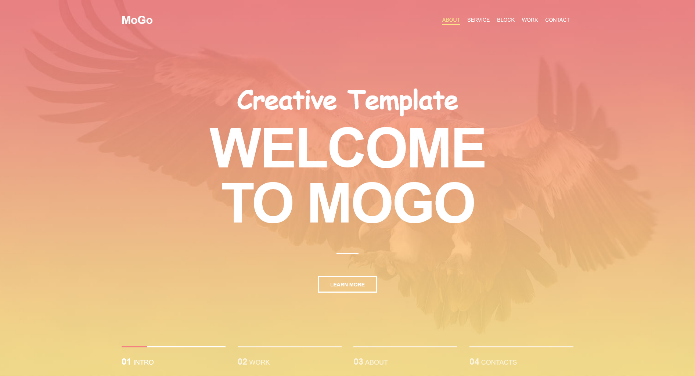

# Mogo 


---

## 📸 Скриншот





---


## 🎯 Цели проекта


- 🎯 Познокомится с React и основами компонентной архитектуры
- 🎯 Познокомится с хуком useState
- 🎯 Переделать сайт с обычной верстки на React, разбив на переиспользуемые компоненты
- 🎯 Работа с Vite как сборщиком
- 🎯 Применить JSX разметку для создания UI
- 🎯 Освоить управление состоянием приложения и передачу данных между компонентами


---

## 🛠️ Используемые инструменты и технологии


### Основные технологии:
- **HTML5**
- **SCSS (Sass)**
- **БЭМ**
- **React**


### Сборка и инструменты:
- **Vite**
- **npm**
- **PostCSS**
- **Stylelint**
- **ESlint**
- **Prettier**


### Разработка и дизайн:
- **WebStorm**
- **Figma**


### Оптимизация и качество:
- **Normalize.css**


### Тестирование:
- **W3C Validator**


---

## 🚀 Как запустить локально
1.  Склонируй репозиторий: <br/>
    ```bash
    git clone https://github.com/Zheny179/react-mogo.git
    ```
2.  Перейдите в папку проекта
    ```bash
    cd react-mogo
    ```
3.  Установите зависимости  <br/>
    ```bash
    npm i
    ```
4.  Запустите проект в режиме разработки: <br/>
    ```bash
    npm run dev
    ```
5.  Для сборки проекта: <br/>
    ```bash
    npm run build
    ```
6.  Для просмотра собранного проекта
   ```bash
   npm run preview
   ```


